# Rocket map selector

[Download link](https://www.file.io/download/7unnjFu3sU8P)

Rocket maps is an app that helps you manage your custom map library from the steam workshop since there's no way (yet) to play on those maps from the epic games launcher

Functionnalities :

- Add a new map
- Change the name of a map
- Remove a map
- Add / Remove favorite
- Basic search and filter

If you are ready to start you first need to download / extract the app and then you can just follow the steps below

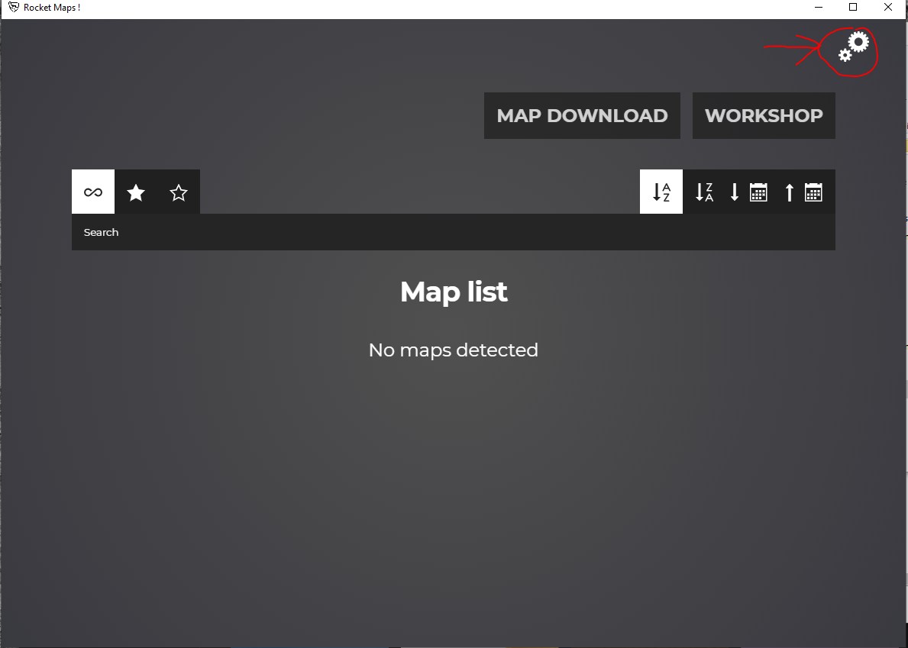

The map path is a random folder to store the maps you will download on your disk

The game folder is the path to your RL installation

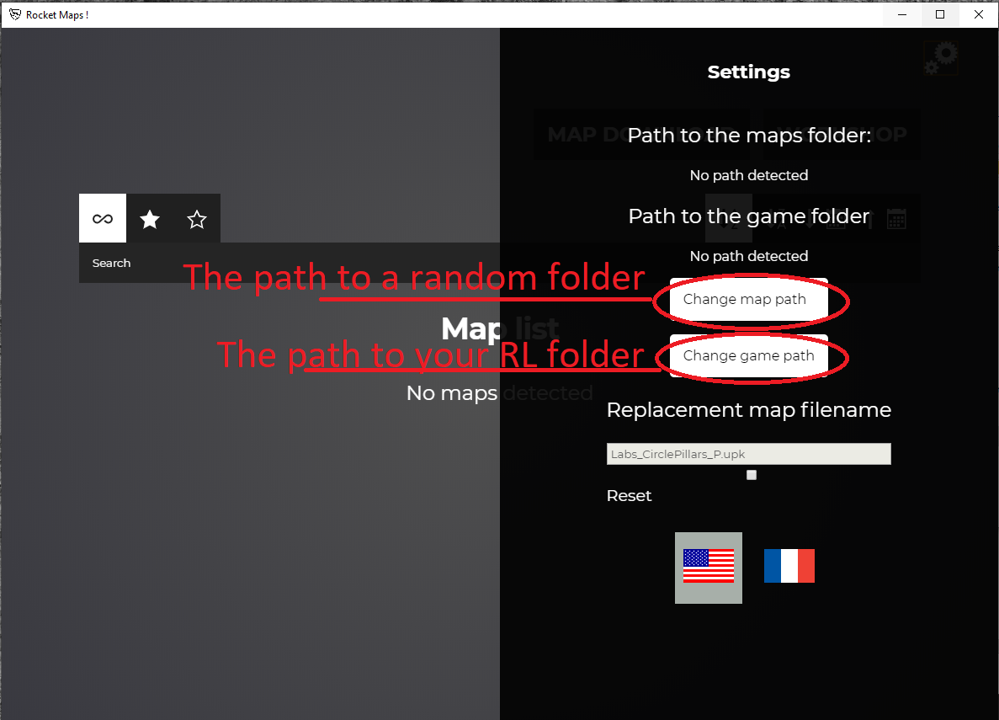

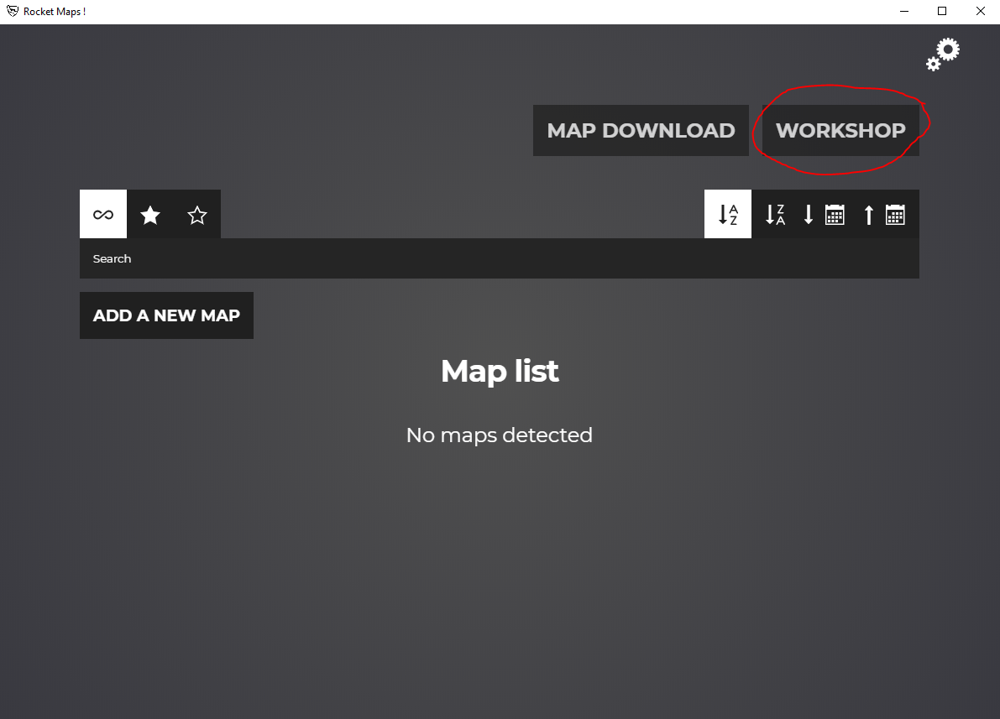

Now pick a map you like on the workshop and copy the url
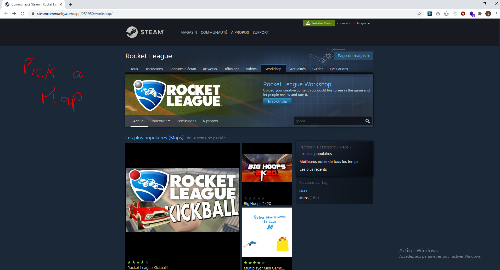
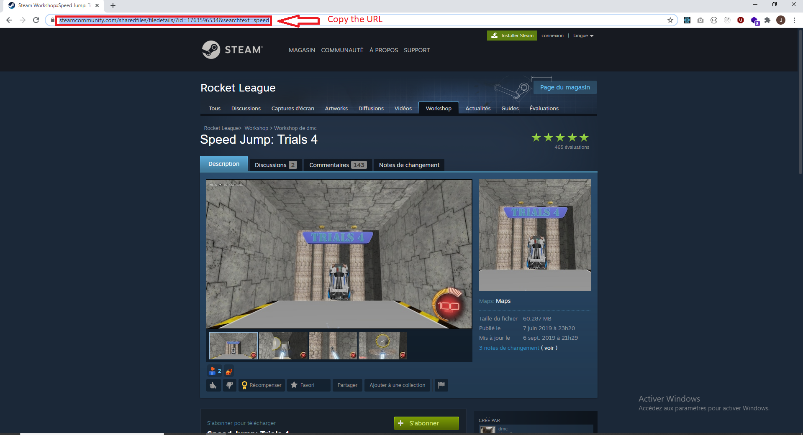

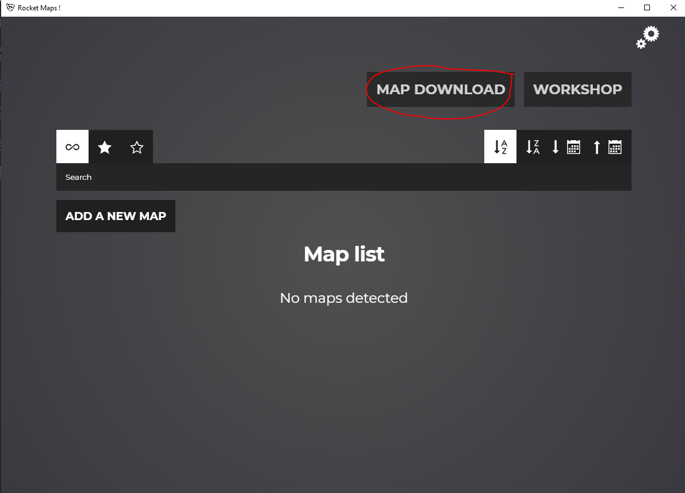

Paste the url in the text input and click on download
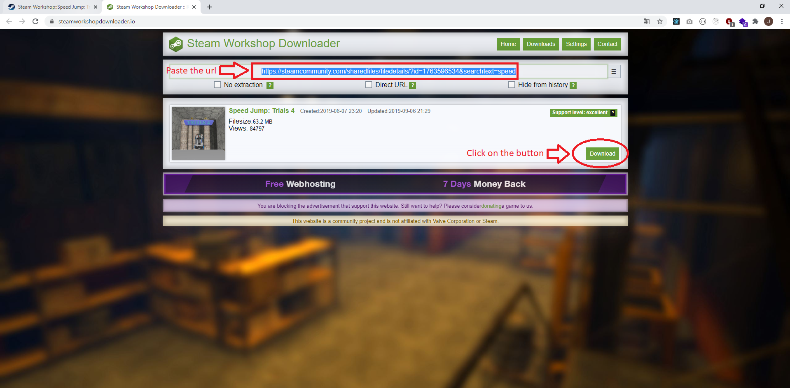

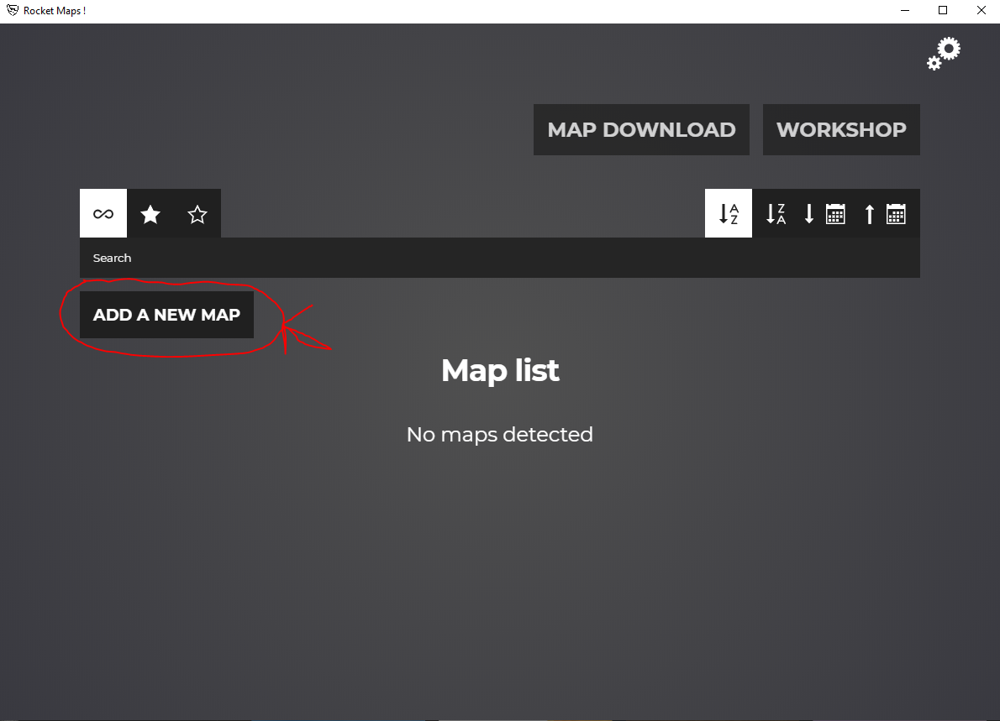

Give a name to the map and select the file you just downloaded (the .zip file)
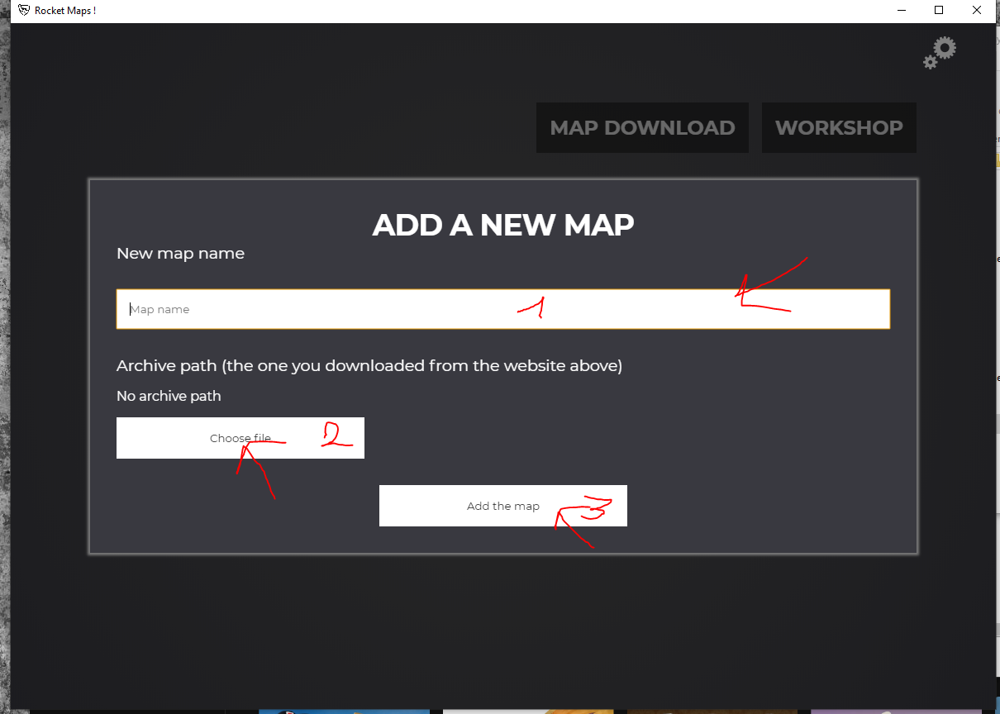
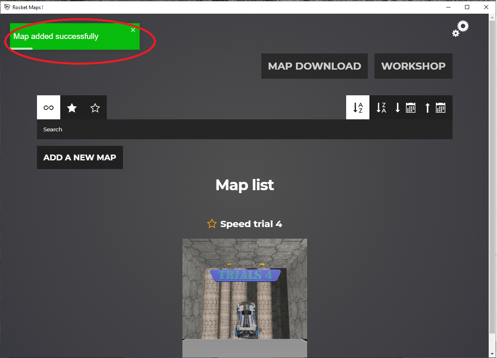
Now click on the play button
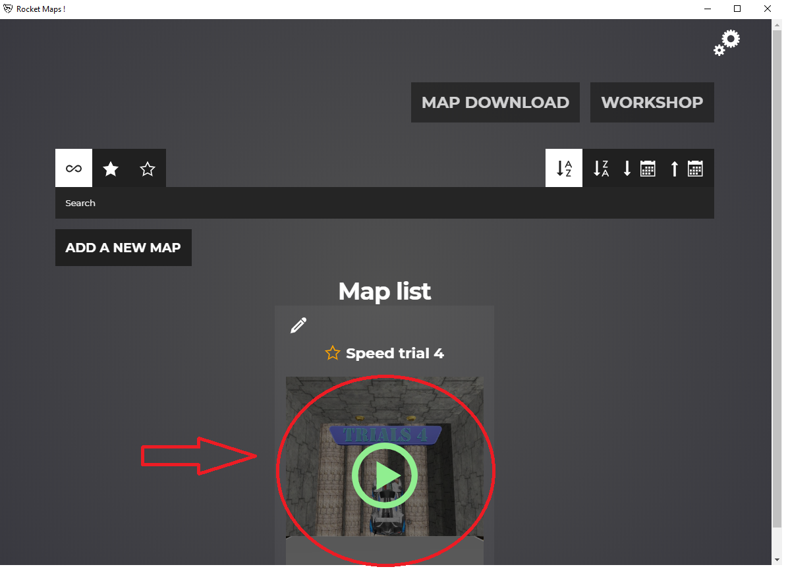

If everything went well you can start RL and go to
Training -> Freeplay and select the Pillar map

By default this is the one being replaced by the map from the workshop, you can change this in the settings

### Misc informations

You don't have to restart your game everytime you want to play on an other map, you juste have to go back to the main menu and click on the play button of the map new map

The app doesn't collect any data and doesn't send anything over the network, it only works on your computer

Settings are stored in AppData\Roaming\rlmapselector

If you have any request or question you can contact me on github or send me an email

Enjoy :)
